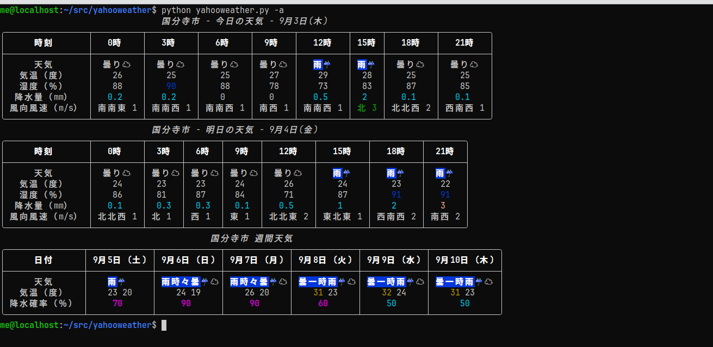

# yahooweather

Yahoo天気をターミナル上のTUI（Text-based User Interface）で表示する軽量ツールです。  
ローカル端末から手早く天気予報を確認したい開発者や端末ユーザー向けに設計されています。

## スクリーンショット



## 特長

- ターミナル上で見やすいTUI表示（現在の天気、気温、予報）
- 手早い更新（リフレッシュ機能）
- カスタム設定（デフォルトの地域を設定可能）
- Yahoo天気から取得した天気データは3時間キャッシュします。

## 必要条件

- Python 3.8+
- ネットワーク接続

## インストール

1. ソースから（推奨）

```bash
git clone https://github.com/tomok14/yahooweather.git
cd yahooweather
python yahooweather.py
```

## コンフィグファイル

~/.config/yahooweather/yahooweather.conf - コンフィグファイル(toml形式)
~/.config/yahooweather/cache.sqlite - Yahoo天気データキャッシュ

## ファイル

- yahooweather.py - 本体
- selector.py - Yahoo天気の地点データ(location.db)から自分の地点を選択してコンフィグファイルに書き込みするツール
- makelocationdb.py - location.dbを作成するツール
- yahooweather.conf.sample - コンフィグファイルのサンプル
