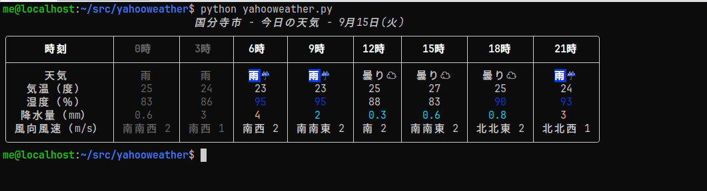
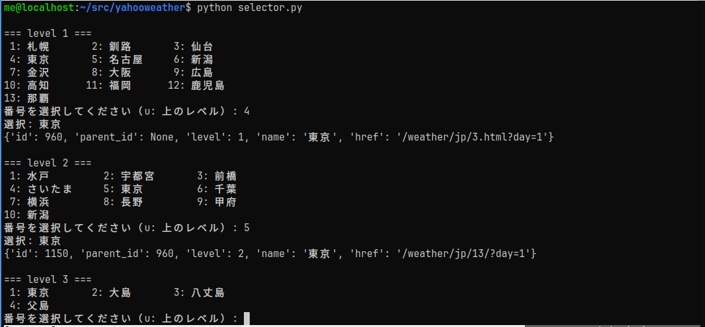

# yahooweather


Yahoo天気をターミナル上のTUI（Text-based User Interface）で表示する軽量ツールです。  
ローカル端末から手早く天気予報を確認したい開発者や端末ユーザー向けに設計されています。

## スクリーンショット


* ノーマル表示（コマンドラインオプション無し）

* All表示（コマンドラインオプション -a）


## 特長

- ターミナル上で見やすいTUI表示（現在の天気、気温、予報）
- 手早い更新（リフレッシュ機能）
- カスタム設定（デフォルトの地域を設定可能）
- Yahoo天気から取得した天気データは3時間キャッシュします。

## 必要条件

- Python 3.8+
- ネットワーク接続

## インストール

1. ソースから（推奨）

```bash
git clone https://github.com/tomok14/yahooweather.git
cd yahooweather
python yahooweather.py
```

## 使用手順

1. selector.pyで地点を設定します。
: `$ python selector.py`
2. yahooweather.py本体を実行します。
: `$ python yahooweather.py`


* selector.py画面


## コンフィグファイル

- ~/.config/yahooweather/yahooweather.conf - コンフィグファイル(toml形式)
- ~/.config/yahooweather/cache.sqlite - Yahoo天気データキャッシュ

## その多機能詳細

- すでに過ぎた時刻は灰色表示されます。
- 12:00以降に実行した場合、翌日の天気も表示されます。

## ファイル

- yahooweather.py - 本体
- selector.py - Yahoo天気の地点データ(location.db)から自分の地点を選択してコンフィグファイルに書き込みするツール。selector.pyを使用せず手動でコンフィグファイルを修正しても良いです。
- makelocationdb.py - location.dbを作成するツール。location.dbは既に作っていますので新たに作成する必要はありません。
- yahooweather.conf.sample - コンフィグファイルのサンプル

## ライセンス

[MITライセンス](https://ja.wikipedia.org/wiki/MIT%E3%83%A9%E3%82%A4%E3%82%BB%E3%83%B3%E3%82%B9)

